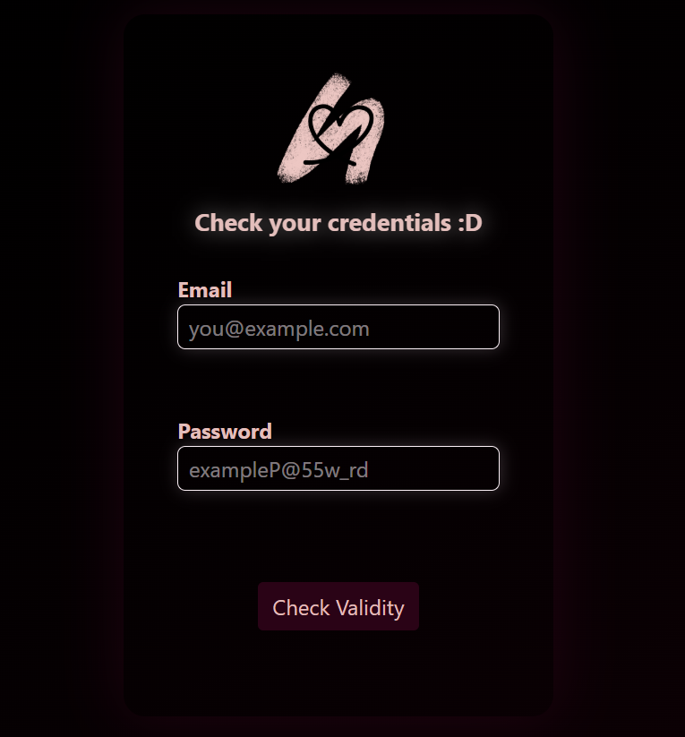

# 💗 Sign Up Tests! <3

A small React + TypeScript practice project built to experiment with React's `useState` hook by creating a simple client-side credential validator.

The app checks whether an entered email and password meet a set of basic requirements and provides immediate feedback before checking whether both credentials are valid.

🔗 **Live Demo:** https://b-got-banned.github.io/react-practice-1/

---

## ✨ Features

* 📧 Real-time email validation
* 🔐 Password requirement validation
* ✅ Final credential validity check
* 💬 User-friendly validation messages
* 🎨 Styled with Tailwind CSS
* 💗 Custom favicon and themed UI
* ⚛️ Built as a React component using `useState`

---

## 🧪 What I Practiced

This project was primarily created as practice for React's **`useState` hook**.

The component uses three pieces of state:

```tsx
const [emailMsg, setEmailMsg] = useState("")
const [passMsg, setPassMsg] = useState("")
const [valMsg, setValMsg] = useState("")
```

These states are used to store and update:

* The email validation message
* The password validation message
* The final credential validation message

The project also gave me some practice with:

* React event handling
* TypeScript event types
* Regular expressions
* Conditional rendering through state
* DOM querying
* Tailwind CSS
* Vite
* GitHub Pages deployment

---

## 📋 Validation Rules

### Email

The email is checked against an email validation pattern.

If the entered email does not match the expected format, the app displays:

> Email is invalid :(

An empty email field does not immediately produce an error message.

### Password

The password must:

* Contain at least **8 characters**
* Contain an **uppercase letter**
* Contain a **lowercase letter**
* Contain a **number**
* Contain a **special character**

If the password does not satisfy these requirements, the app displays an explanation of what is missing.

### Final Validation

When **Check Validity** is clicked, the app checks whether:

1. Both fields have been provided.
2. The email is valid.
3. The password is valid.

Depending on the result, the user receives a final message such as:

```text
You're good to go :)
```

or an appropriate validation message.

---

## 🛠️ Tech Stack

* **React 19**
* **TypeScript**
* **Vite**
* **Tailwind CSS 4**
* **ESLint**
* **GitHub Pages**

---

## 📁 Project Structure

```text
react-practice-1/
│
├── src/
│   ├── assets/
│   │   ├── heart.png
│   │   └── preview.png
│   │
│   ├── components/
│   │   └── Form.tsx
│   │
│   ├── App.tsx
│   ├── index.css
│   └── main.tsx
│
├── .gitignore
├── eslint.config.js
├── index.html
├── package.json
├── tsconfig.json
├── tsconfig.app.json
├── tsconfig.node.json
└── vite.config.ts
```

### Main Component

`Form.tsx` contains the main functionality of the application.

It handles:

* Email validation
* Password validation
* Updating validation messages
* Checking the final validity of the credentials

---

## 🚀 Getting Started

### Prerequisites

Make sure you have **Node.js** and **npm** installed.

### 1. Clone the repository

```bash
git clone https://github.com/B-got-banned/react-practice-1.git
```

### 2. Navigate into the project

```bash
cd react-practice-1
```

### 3. Install dependencies

```bash
npm install
```

### 4. Start the development server

```bash
npm run dev
```

The application will then be available through the local development URL provided by Vite.

---

## 📦 Available Scripts

| Command           | Description                                |
| ----------------- | ------------------------------------------ |
| `npm run dev`     | Starts the Vite development server         |
| `npm run build`   | Type-checks and builds the application     |
| `npm run lint`    | Runs ESLint                                |
| `npm run preview` | Previews the production build              |
| `npm run deploy`  | Builds and deploys the app to GitHub Pages |

---

## 🌐 Deployment

The project is deployed using **GitHub Pages** and the `gh-pages` package.

The Vite configuration uses the repository name as the deployment base:

```ts
export default defineConfig({
  plugins: [react(), tailwindcss()],
  base: '/react-practice-1/'
})
```

The deployment process can be run with:

```bash
npm run deploy
```

---

## ⚠️ Important Note

This project is a **frontend validation exercise** and is not an authentication system.

The entered credentials are only checked locally in the browser. No credentials are sent to a backend, stored in a database, or authenticated against an actual account.

This project is intended for learning and demonstrating frontend validation and React state management.

---

## 📸 Preview

### Live Application

You can try the deployed application here:

**https://b-got-banned.github.io/react-practice-1/**



---

## 💭 Future Improvements

Some things I could explore in a future version:

* [ ] Add a password visibility toggle
* [ ] Replace the `<textarea>` elements used for messages with more semantic elements
* [ ] Improve accessibility and form semantics
* [ ] Move validation logic into reusable functions
* [ ] Use controlled inputs instead of querying the DOM directly
* [ ] Add a backend for actual authentication
* [ ] Add automated tests for the validation logic
* [ ] Add more detailed error states

---

⭐ If you're checking out this project, thanks for stopping by!
